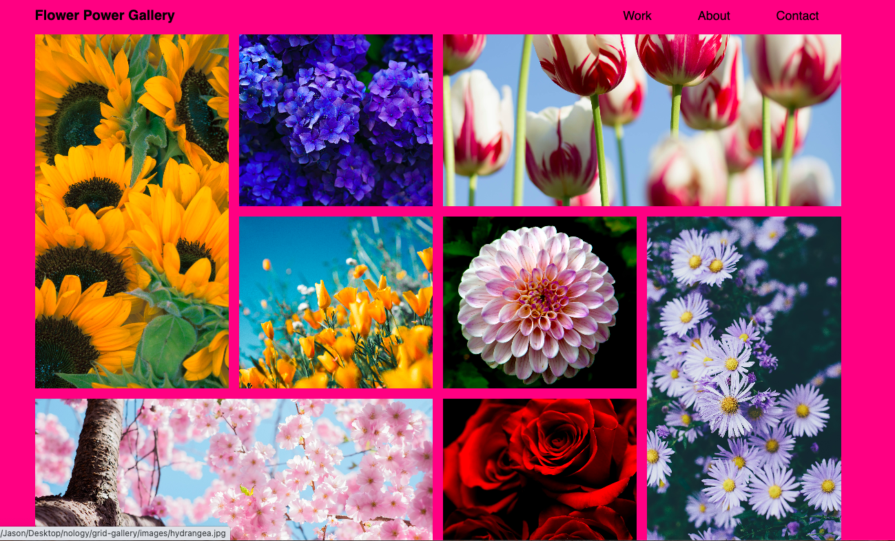
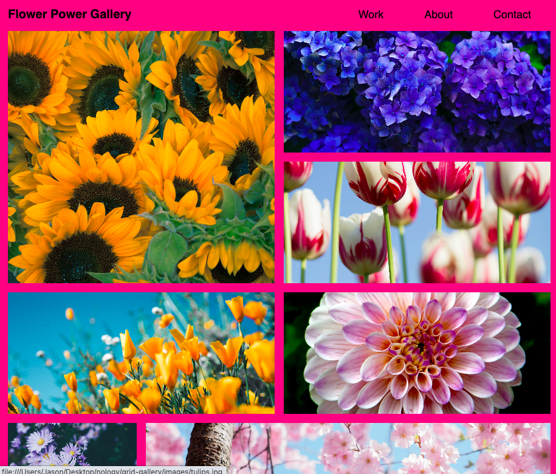
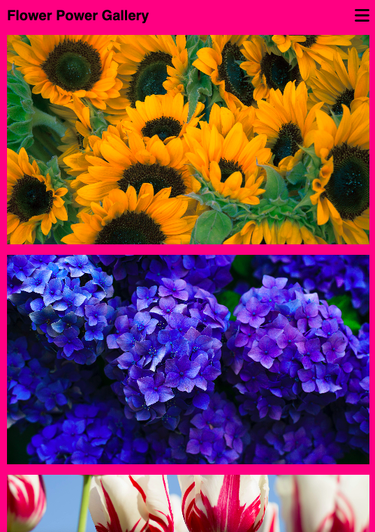

# Flower Power Grid Gallery

## Description

This project is a mobile-responsive grid gallery that displays 8 photos of flowers using CSS grid/media queries. I utilized anchor tags with background images in order to make each image clickable so users could see the whole image in another tab if desired. The nav links are "removed" and replaced with a hamburger icon on mobile-screen display.

### Desktop

### Tablet

### Mobile
